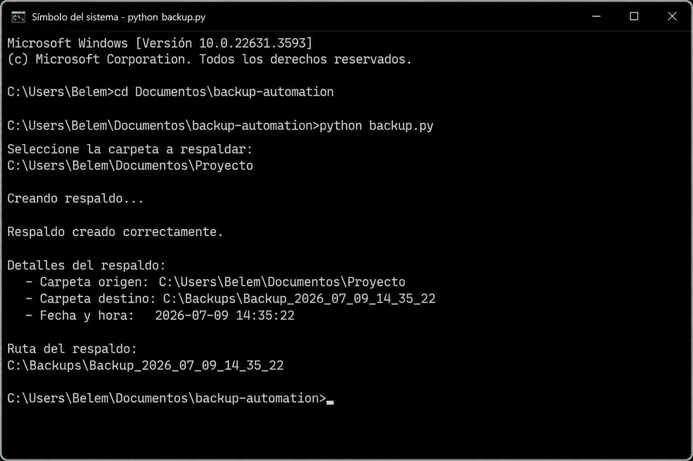

# Backup Automation

## Descripción

**Backup Automation** es un proyecto de automatización desarrollado en Python cuyo objetivo es realizar copias de seguridad automáticas de una carpeta seleccionada por el usuario.

El programa genera automáticamente una carpeta de respaldo con la fecha y hora actuales, facilitando la organización y recuperación de archivos importantes.

---

## Características

* Automatiza copias de seguridad
* Previene la pérdida de información
* Genera carpetas organizadas por fecha y hora
* Interfaz simple y fácil de usar
* Compatible con Windows y Linux

---

## Requisitos

Antes de ejecutar el proyecto es necesario contar con:

* Python 3.10 o superior
* Visual Studio Code (opcional)
* Git
* Sistema operativo Windows o Linux

---

## Instalación

### 1. Clonar el repositorio

```bash
git clone https://github.com/usuario/backup-automation.git
```

### 2. Entrar al proyecto

```bash
cd backup-automation
```

### 3. Ejecutar el programa

```bash
python backup.py
```

---

## Uso

Al ejecutar el programa, el sistema solicitará la ruta de la carpeta a respaldar.

### Ejemplo de ejecución

```text
Seleccione la carpeta a respaldar:
C:\Documentos

Creando respaldo...

Respaldo creado correctamente.

Ruta:
C:\Backups\Backup_2026_07_09
```

---

## Resultado esperado

Después de ejecutar el programa, se genera automáticamente una carpeta de respaldo con todos los archivos copiados correctamente y organizados por fecha.



---

## Estructura del proyecto

```
backup-automation/
│
├── backup.py
├── README.md
└── resultado.png
```

---

## Tecnologías utilizadas

* Python
* Git
* GitHub
* Visual Studio Code

---

## Autor

Belem Fernanda Sánchez González
Ingeniería en Redes Inteligentes y Ciberseguridad
Universidad Tecnológica de Aguascalientes

---

## Licencia

Este proyecto se distribuye bajo la Licencia MIT.

Copyright (c) 2026 Belem Fernanda Sánchez González


Se concede permiso para usar, copiar, modificar y distribuir este software siempre que se conserve este aviso de copyright.
